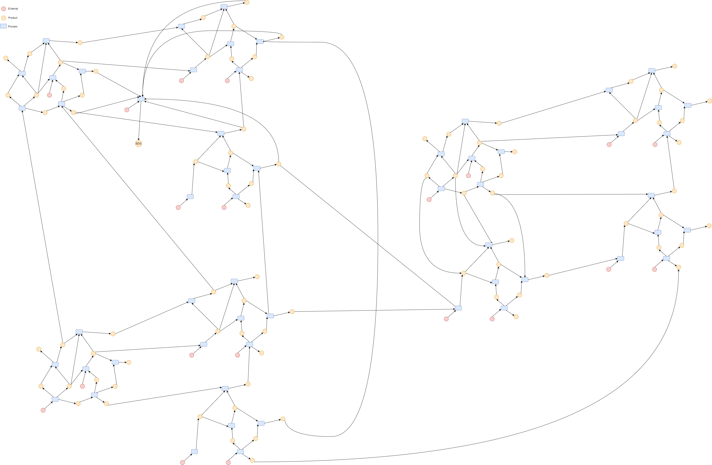
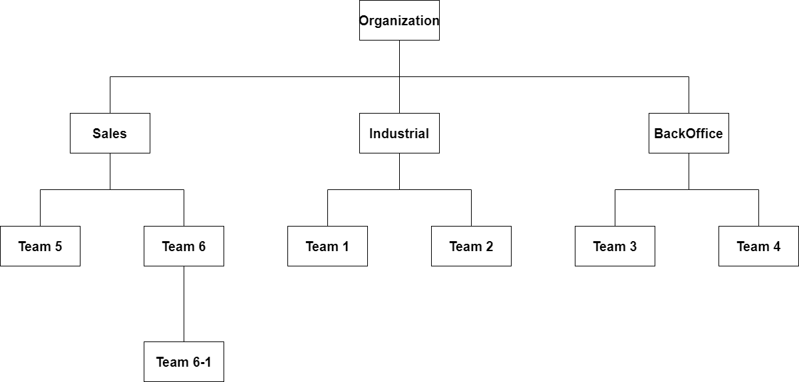
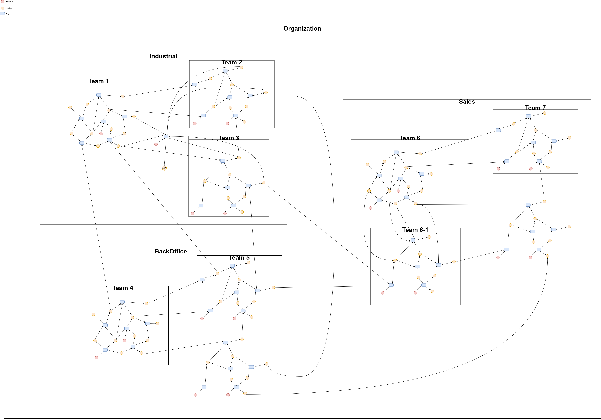
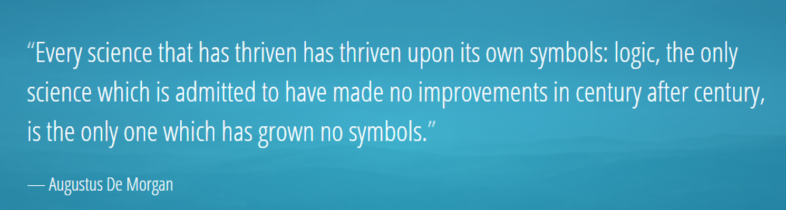

# MangeNets MVP

ManageNets is a web application and framework for process modelling inspired by the the AAR (Actor-Actions-Resourves)
model and State Space Machines.

The main goal is to shed some light on the operational structure of an organization or any delivering system, allowing processes
to be mapped in a distributed manner and enhancing the use of network analysis tools in process management. Also, more organic governance
can be designed for complex systems starting from the operational level towards the organizational (bottom-up), instead of the
top down aproax commonly taken.

# What's in stake?

## A delivery system might look like this:

 
Such systems can be intricate and messy, although might display some modularity.
Governance should somehow reflect these community structures, since managers should be able to 
address local issues avoiding interefence in other modules.

## Governance in other hand tends to look much tider:

 

## A Process Netwrok such as the one shown above helps us to optimally map from operational reality to governance!

# Creating such network representation is costly, why not distribute then?
ManageNets tries to address this issue, providing a process network modeling tool, in which employees and managers can create their
process and products locally, and by referencing their processes inputs, all the network is created in a distributed manner!

# Why such efort to build this network, what is the use of it?
 
Just as a map of the landscape is impotant for a militar comander, knowing the map of the full process networks empowers
managers to:
 
 *make creative questions
 *run simulations 
 *make use of a huge amount of network analysis tools
 *try different process design patterns
 *much more!

Long sotry short: distiling what once said 19th century logician Augustus de Morgan, just before mathematical formalization of logic: representation maters a lot!

 

 
